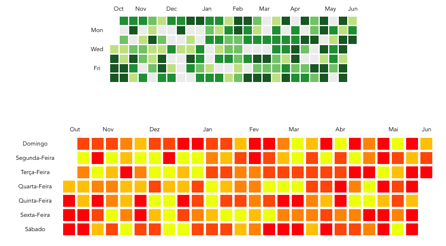

# Vue-github-heatmap

Vue-github-heatmap is a Vue.js component, inspired in github's heatmap for commits as showed in profile.

<p align="center">
    
</p>

## Installation

### Dependencies (First-run )

```
$ npm install
```

## Development
```
$ npm run serve
```

## Build
```
$ npm run build
```

## Usage

Minimal Usage:

```html
   <GitHubHeatMap
       :days="json"
   ></GitHubHeatMap>
```

Json Model:
```json
   [
     {
       "date":"2016-10-12",
       "count":14
     },
     {
       "date":"2016-10-13",
       "count":44
     },
     {
       "date":"2016-10-14",
       "count":50
     }
   ]
```

## Configurations

```html
   <GitHubHeatMap
       :days="json"
       :colors="['#EEFF07', '#FFC706', '#FF8F05', '#FF4F04', '#FF0004']"
       :styling="{ width: 15, height: 15, margin: 1 }"
       :locale="{
           months: ['Jan', 'Fev', 'Mar', 'Abr', 'Mai', 'Jun', 'Jul', 'Ago', 'Set', 'Out', 'Nov', 'Dez'],
           days: ['Domingo', 'Segunda-Feira', 'Terça-Feira', 'Quarta-Feira', 'Quinta-Feira', 'Sexta-Feira', 'Sábado'],
           no: 'Não há',
           commit: 'contribuições',
           on: 'em',
       }"
   ></GitHubHeatMap>
```
